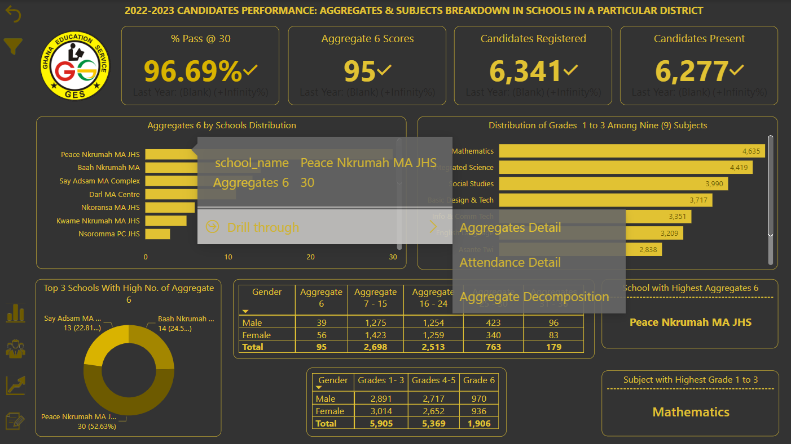
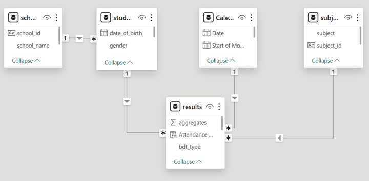
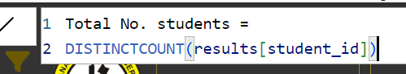
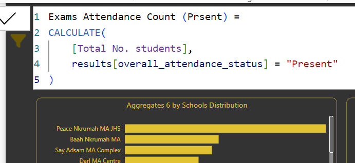

## <h1 align="center"> 2022-2023 CANDIDATES PERFORMANCE: AGGREGATES & SUBJECTS ANALYSIS IN SCHOOLS IN A PARTICULAR DISTRICT IN GHANA </h1>

## Project Overview
The district education department within the Ghana Education Service lacks a comprehensive system for tracking key performance indicators (KPIs) such as enrollment, exam attendance, student aggregates, and subject-grade trends. This absence hampers their ability to effectively compare school and student performance and identify schools with high aggregate scores. There's a pressing need to streamline data collection, analysis, and visualization to facilitate informed decision-making and improve overall educational outcomes.

KEY PERFORMANCE INDICATORS (KPIs) include
  - Enrolment in Junior High School 3
  - Number of candidates registered
  - Number of candidates present during examination
  - Number of candidates absent during examination
  - Subject grades
  - Number of candidates obtaining aggregates as indicated below:
    - Aggregates 6
    - Aggregates 7 - 15
    - Aggregates 16 - 24
    - Aggregates 25 - 30
    - Aggregates 31 - 36
    - Aggregates 36 - 42
## Objectives (Business Intelligent Analyst)
- Utilize Power BI Desktop to establish connections and transform raw HTML data files into a structured format conducive to analysis.
- Develop a comprehensive relational data model within Power BI Desktop, ensuring clear and effective relationships between different data entities.
- Employ Data Analysis Expressions (DAX) in Power BI Desktop to create calculated columns and measures, enabling advanced calculations and insights generation.
- Design and implement an interactive dashboard using Power BI Desktop, leveraging its visualization capabilities to present key metrics and trends in an intuitive and actionable manner.

## Tech Stack
- Data Extraction and Transformation: Power BI Desktop for connecting to and transforming raw HTML data files into a structured format.
- Data Modeling: Power BI Desktop for building a relational data model to support analytical queries and reporting.
- Calculations and Measures: Utilize DAX (Data Analysis Expressions) within Power BI Desktop to create calculated columns and measures for deriving insights from the data.
- Dashboard Design: Design interactive dashboards within Power BI Desktop to visualize key metrics and facilitate data-driven decision-making for district education stakeholders.

## METHODOLOGY - Extraction, Transformation and Loading (ETL)
I've included youtube videos explaining the details of how the raw data was extracted from tables in html files, how the primary keys and table relationships were created. [Click here to access it](https://youtu.be/aA3GNJTjufY)

### Data Model

### DAX USED IN CREATING MEASURES 
Various DAX measures were created to calculate key performance indicators (KPIs) such as enrollment, exam attendance, subject grades, and aggregate scores. These measures enable precise analysis and insights generation.
  - **Enrolment in Junior High School 3**: 
    - 
    - *Enrolment = [Total No. students]*
  - **Number of candidates registered**:
     - *Candidates Registered = [Total No. students]*
  - **Number of candidates present during examination**:
    
  - **Candidates Obtaining Grade 1 to 3 in the various subjects**:
      - => *Candidates Obtaining Grades 1- 3 = 
      CALCULATE(
          [Total No. students], 
          results[grades] >= 1 && results[grades] <= 3
      )*
   - **Number of candidates obtaining aggregates 6**:
       - => *Aggregates 6 = 
      CALCULATE(
          [Total No. students], 
          results[aggregates] = 6
      )*
   - **% Pass at 30**:
       - => *% Pass @ 30 = 
            DIVIDE(
                (
                    [Aggregates 6] + 
                    [Aggregates 7 - 15] +
                    [Aggregates 16 - 24] +
                    [Aggregates 25 - 30]
                ),
                [Exams Attendance Count (Prsent)]
            )*
## Insights Derived from Data Analysis
I have captured the insights derived from the data analysis process in a YouTube video [here](https://youtu.be/aA3GNJTjufY))
.

## Challenges
Challenges encountered in the project included data quality issues, performance optimization, and data security and privacy concerns. These challenges were addressed through thorough data cleaning, performance testing and optimization, and utilization of Power BI's security features.

## Recommendations
To address challenges faced during the project:
  -  Thorough data cleaning was conducted to address data quality issues and ensure consistency.
  -  Performance testing and optimization techniques were employed to enhance the speed and efficiency of Power BI reports and dashboards.
  -  Power BI's security features, including row-level security and encryption, were utilized to safeguard sensitive student information and ensure compliance with data protection regulations.

