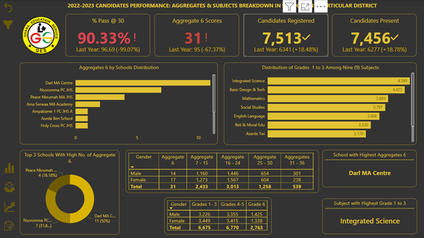

## <h1 align="center"> 2022-2023 CANDIDATES PERFORMANCE: AGGREGATES & SUBJECTS ANALYSIS IN SCHOOLS IN A PARTICULAR DISTRICT IN GHANA </h1>

## Problem Statement 
The district education department within the Ghana Education Service lacks a comprehensive system for tracking key performance indicators (KPIs) such as enrollment, exam attendance, student aggregates, and subject-grade trends. This absence hampers their ability to effectively compare school and student performance and identify schools with high aggregate scores. There's a pressing need to streamline data collection, analysis, and visualization to facilitate informed decision-making and improve overall educational outcomes.
KEY PERFORMANCE INDICATORS (KPIs) include
  - Enrolment in Junior High School 3
  - Number of candidates registered
  - Number of candidates present during examination
  - Number of candidates absent during examination
  - Subject grades
  - Number of candidates obtaining aggregates as indicated below:
    - Aggregates 6
    - Aggregates 7 - 15
    - Aggregates 16 - 24
    - Aggregates 25 - 30
    - Aggregates 31 - 36
    - Aggregates 36 - 42
## Objectives (Business Intelligent Analyst)
- Utilize Power BI Desktop to establish connections and transform raw HTML data files into a structured format conducive to analysis.
- Develop a comprehensive relational data model within Power BI Desktop, ensuring clear and effective relationships between different data entities.
- Employ Data Analysis Expressions (DAX) in Power BI Desktop to create calculated columns and measures, enabling advanced calculations and insights generation.
- Design and implement an interactive dashboard using Power BI Desktop, leveraging its visualization capabilities to present key metrics and trends in an intuitive and actionable manner.

## Tech Stack
- Data Extraction and Transformation: Power BI Desktop for connecting to and transforming raw HTML data files into a structured format.
- Data Modeling: Power BI Desktop for building a relational data model to support analytical queries and reporting.
- Calculations and Measures: Utilize DAX (Data Analysis Expressions) within Power BI Desktop to create calculated columns and measures for deriving insights from the data.
- Dashboard Design: Design interactive dashboards within Power BI Desktop to visualize key metrics and facilitate data-driven decision-making for district education stakeholders.

## Extraction, Transformation and Loading 
I've included youtube video explaining the details of how the raw data was extracted from tables in html files.
  - Data Model
    
  - Some of the DAX created to calculate the Key Performance Indicators

